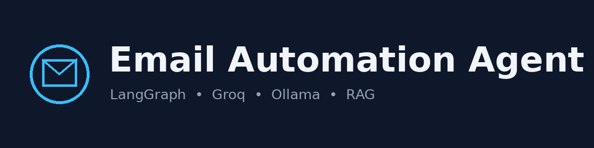

<p align="center">
  
</p>

<h1 align="center">Customer Support Email Automation</h1>
<p align="center"><b>Groq + Ollama + LangGraph + Dashboard</b></p>

<p align="center">
  
  
  
  
  
</p>

---

## 📖 About the Project

This project is an **AI agent pipeline that runs a customer support inbox for you.**
It watches a Gmail inbox, and for every new email it:

1. **Categorizes** the email (product-related vs. unrelated),
2. **Retrieves relevant context** from your own knowledge base using **RAG** (Retrieval-Augmented Generation),
3. **Drafts a reply** grounded in that context,
4. **Proofreads and rewrites** the draft if needed,
5. **Hands it to a human** for one-click approval from a web dashboard — nothing is ever sent without your sign-off.

The whole thing is orchestrated as a **LangGraph** state machine, so every step (categorize → retrieve → write → proofread → send) is an explicit, inspectable node in a graph — and any node that fails is isolated and skipped instead of crashing the run.

It uses a **hybrid local/hosted model stack**:

| Task | Model | Why |
|---|---|---|
| Categorizing emails, drafting RAG search queries | Ollama `qwen2.5:1.5b` (local) | Cheap, high-volume, low-stakes decisions — free and fast |
| Writing & proofreading the customer-facing reply | Groq `llama-3.3-70b-versatile` (hosted) | Higher-stakes generation needs a stronger model |
| Embeddings for the vector store | Ollama `nomic-embed-text` (local) | No per-query API cost for RAG retrieval |

Everything is backed by **SQLite** for persistence (so a run survives a restart) and a **FastAPI + Langserve** dashboard for visibility and control.

> Originally based on [kaymen99/langgraph-email-automation](https://github.com/kaymen99/langgraph-email-automation), reworked here with a hybrid model stack, a dashboard, persistence, error isolation, and a full automated test suite.

---

## 🧭 System Flowchart

<p align="center">
  
</p>

The graph itself is unchanged in shape, plus one addition: any fallible step (categorize, RAG, write, proofread, Gmail I/O) that throws now routes to `handle_processing_error`, which logs the failure, drops the offending email from the queue, and loops back to check the next one — instead of crashing the whole batch.

---

## 🛠️ Tech Stack

- **LangChain / LangGraph** — agent workflow orchestration
- **Groq** (`llama-3.3-70b-versatile`) — hosted LLM for writing/proofreading
- **Ollama** (`qwen2.5:1.5b`, `nomic-embed-text`) — local LLM + embeddings
- **Chroma** — vector store for RAG
- **FastAPI + Langserve** — API + workflow playground
- **SQLite** — pipeline/email persistence for the dashboard
- **Gmail API** — inbox monitoring and draft/send
- **pytest** — automated test suite (36 tests, fully mocked, no network required)

---

## ⚙️ Setup

### Prerequisites

- Python 3.10+
- [Ollama](https://ollama.com) installed and running locally, with these models pulled:
  ```sh
  ollama pull qwen2.5:1.5b
  ollama pull nomic-embed-text
  ```
- A [Groq API key](https://console.groq.com/keys)
- A Gmail account you'll grant this project API access to (see below)

### Install

```sh
git clone <this-repo>
cd <this-repo>
python -m venv venv
source venv/bin/activate  # On Windows: venv\Scripts\activate
pip install -r requirements.txt
```

---

## 🔑 Getting `credentials.json` (Gmail API access)

`credentials.json` isn't something you write yourself — it's a file you **download from Google Cloud Console** after setting up OAuth for your project. Here's the exact path:

**1. Create/select a Google Cloud project**
Go to [console.cloud.google.com](https://console.cloud.google.com), create a project (or use an existing one).

**2. Enable the Gmail API**
In that project, search for **"Gmail API"** and enable it.

**3. Configure the OAuth consent screen**
Cloud Console → **Google Auth platform** → **Branding**:
- **App name**: anything (e.g. *"Email Automation Agent"*)
- **Support email**: your email
- **User type**: *Internal* is fine if you're just using your own Gmail account for testing
- Skip adding scopes here — you'll grant them at auth time instead

**4. Create the OAuth client** (this produces the file)
Cloud Console → **Google Auth platform** → **Clients** → **Create Client**:
- **Application type**: Desktop app
- Give it any name
- Click **Create**

A JSON file downloads automatically. Rename it to `credentials.json` and put it in your project root (`project/credentials.json`, next to `main.py`).

> **One important difference from Google's quickstart doc:** that doc's sample uses the `gmail.readonly` scope — but this project needs to **read, create drafts, and send**, not just read. Open `src/tools/GmailTools.py` and check the `SCOPES` variable at the top — it should already be set to something like `gmail.modify` or `gmail.send` + `gmail.readonly`. Whatever scope is defined there is what Google will ask you to approve, so you don't need to add scopes manually in the Cloud Console step above.

**What happens on first run:**
You don't need to run Google's `quickstart.py` sample — just run this project (`python main.py` or `python deploy_api.py`). The first time it needs Gmail access, it will:
1. Open a browser window asking you to sign in and approve access
2. Save a `token.json` file automatically so you're not prompted again

---

## 📝 Configuration — `.env`

Copy the example file and fill it in:

```sh
cp .env.example .env
```

```dotenv
# --- Identity / Gmail ---
MY_EMAIL="Your email"

# --- Groq (hosted) — used for writing & proofreading customer-facing replies ---
GROQ_API_KEY="Your GROQ API KEY"
GROQ_LLM_MODEL=llama-3.3-70b-versatile

# --- Ollama (local) — used for categorization, RAG query design, and embeddings ---
# Make sure `ollama serve` is running and you've pulled:
#   ollama pull qwen2.5:1.5b
#   ollama pull nomic-embed-text
OLLAMA_BASE_URL=http://localhost:11434
OLLAMA_LLM_MODEL=qwen2.5:1.5b
OLLAMA_EMBED_MODEL=nomic-embed-text

# --- Storage ---
DB_PATH=./data/app.db
CHROMA_PERSIST_DIR=db

# --- Behavior tuning ---
MAX_REWRITE_TRIALS=3
EMAIL_LOOKBACK_HOURS=8
LLM_MAX_RETRIES=3
LLM_RETRY_BASE_SECONDS=2
```

| Variable | Description |
|---|---|
| `MY_EMAIL` | The Gmail address the agent monitors and sends from |
| `GROQ_API_KEY` | Your Groq API key, used for the writer/proofreader models |
| `GROQ_LLM_MODEL` | Groq model used for drafting & proofreading replies |
| `OLLAMA_BASE_URL` | Where your local Ollama instance is running |
| `OLLAMA_LLM_MODEL` | Local model used for categorization & RAG query generation |
| `OLLAMA_EMBED_MODEL` | Local embedding model used to build/query the vector store |
| `DB_PATH` | SQLite database file for pipeline/email persistence |
| `CHROMA_PERSIST_DIR` | Where the Chroma vector store is persisted on disk |
| `MAX_REWRITE_TRIALS` | Max number of proofreader-requested rewrites before giving up |
| `EMAIL_LOOKBACK_HOURS` | How far back to look for "new" emails on each pass |
| `LLM_MAX_RETRIES` | Retry attempts for a failed LLM call |
| `LLM_RETRY_BASE_SECONDS` | Base backoff (seconds) between LLM call retries |

Place your downloaded `credentials.json` (from the Gmail API step above) in the project root, next to `main.py`.

---

## 📚 Build the Knowledge Base

Put your agency/company docs in `data/` (a starter `data/agency.txt` is included), then:

```sh
python create_index.py
```

This checks that Ollama is reachable, then builds the local Chroma vector store used for RAG.

---

## ▶️ Run

**CLI mode** (single pass over the inbox, prints progress to the terminal):
```sh
python main.py
```

**Dashboard + API** (recommended — lets you watch and approve drafts):
```sh
python deploy_api.py
```

Then open:
- `http://localhost:8000` — the dashboard
- `http://localhost:8000/docs` — API docs
- `http://localhost:8000/workflow/playground` — raw Langserve playground

From the dashboard, click **"Run inbox pass"** to trigger a batch run; drafts that pass proofreading land in the **Awaiting your approval** panel, where you can **Send** or **Discard** each one.

---

## ✅ Run the Tests

```sh
pip install pytest pytest-mock  # already in requirements.txt
pytest tests/ -v
```

All 36 tests run against mocked Gmail and mocked LLM responses — no API keys, Ollama instance, or network access required. They cover:
- Gmail body extraction (plain text, HTML, multipart, nested multipart, empty/malformed)
- Every node's happy path and its failure-isolation path
- Full graph runs: empty inbox, unrelated-email skip, product enquiry → RAG → draft, a complaint that needs one rewrite, exhausting max rewrite trials, a mid-pipeline model failure, a Gmail outage on fetch, and processing multiple emails in one pass
- The SQLite persistence layer
- The dashboard's REST API, including the full run → approve → send flow

---

## 🐞 Bugs Fixed (caught by the test suite)

1. After exhausting rewrite attempts on the *last* email in the queue, the graph used to route straight back into `categorize_email` on an empty list — an `IndexError` waiting to happen. It now routes through the empty-inbox check like every other exit path.
2. `GmailTools._get_email_body` assumed every MIME part has a `body` key. Multipart container parts (e.g. `multipart/alternative`) often don't, and would raise `KeyError` on certain real-world emails.

---

## 🎛️ Customization

- Change model choices in `.env` (`GROQ_LLM_MODEL`, `OLLAMA_LLM_MODEL`, `OLLAMA_EMBED_MODEL`).
- Tune rewrite/retry behavior via `MAX_REWRITE_TRIALS`, `LLM_MAX_RETRIES`, `LLM_RETRY_BASE_SECONDS` in `.env`.
- Agent prompts live in `src/prompts.py`; node logic in `src/nodes.py`.
- Add your own knowledge base files to `data/` and rerun `python create_index.py`.

---

## 🤝 Contributing

Contributions are welcome! Please open an issue or submit a pull request for any changes.
